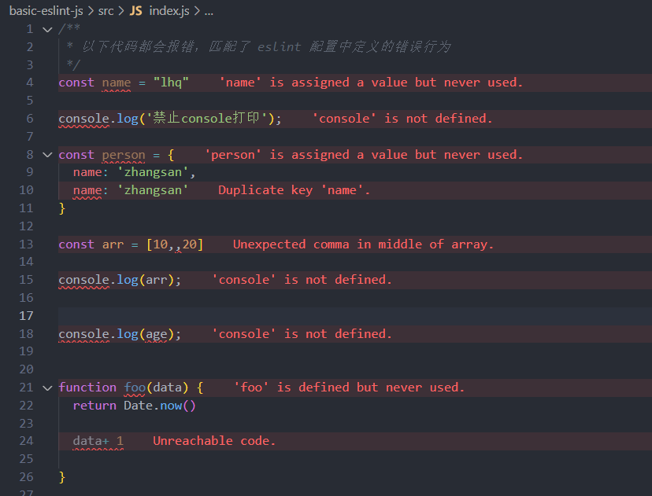

## eslint-notes

### 项目工程化代码规范 ESLint

```
什么是 ESLint?

ESLint 是一种 JavaScript 和 TypeScript 代码质量检査工具，确保代码在语法、逻辑和风格上符合预定的规范。
ESLint 提供了灵活的配置，适应不同的项目需求。

为什么要使用 ESLint?

ESLint 的主要目的是在代码编写过程中即发现潜在错误，提升代码质量。

ESLint 的核心原理

ESLint 基于 AST(抽象语法树)分析代码，将其转化为结构化的数据，通过分析树节点来识别不符合规则的部分。
这种方式使得 ESLint 能够精确检查代码结构。

```

**在团队中推广编码规范化和引入 ESLint 为了提高代码的一致性、可读性，减少错误，提高维护性。我们做了以下针对不同项目(JS、TS、Vue)采用的 ESLint 配置尝试，并总结出很多具体实践经验。**

核心规则介绍

为了确保代码质量和一致性，我们配置了几个重要的规则:

- "no-console":"error"，禁止使用 console，避免在生产代码中输出调试信息。
- "no-unused-vars":"error"，禁止未使用的变量，确保代码中所有声明的变量都有实际用途。
- "no-sparse-arrays":"error"，避免稀疏数组，防止不必要的空元素带来的潜在问题。
- "no-undef":"error"，禁止使用未定义的变量，确保所有变量都是明确定义的。
- "no-unreachable":"error"，避免无法到达的代码，提升代码可读性。
- "no-dupe-keys":"error"，禁止对象字面量中的重复键值对，避免逻辑错误。

> js 中使用 Eslint

vscode 安装错误提示插件

- ESLint 错误显示红色波浪线
- Error Lens 错误描述提示
  

### 主要依赖

- "eslint": eslint 核心依赖
- "@eslint/js": eslint 规则集简化插件
- "typescript": ts 项目核心依赖
- "@typescript-eslint/parser": 添加该插件，帮助 eslint 识别 ts 语法
- "vue-eslint-parser": 添加该插件帮助 eslint 识别 vue 语法

### 团队协作与代码风格的统一

- ESLint 与 Prettier 的集成

**在开发中，ESLint 主要负责语法和代码逻辑检査，而 Prettier 专注于代码格式化。将两者结合可使代码格式和风格一致，减少团队冲突。**

- 代码风格统一的益处

**通过自动化的风格统一，团队成员无需在风格上浪费时间，PR 审查也更高效，大家可以集中精力于业务逻辑和架构优化。**
